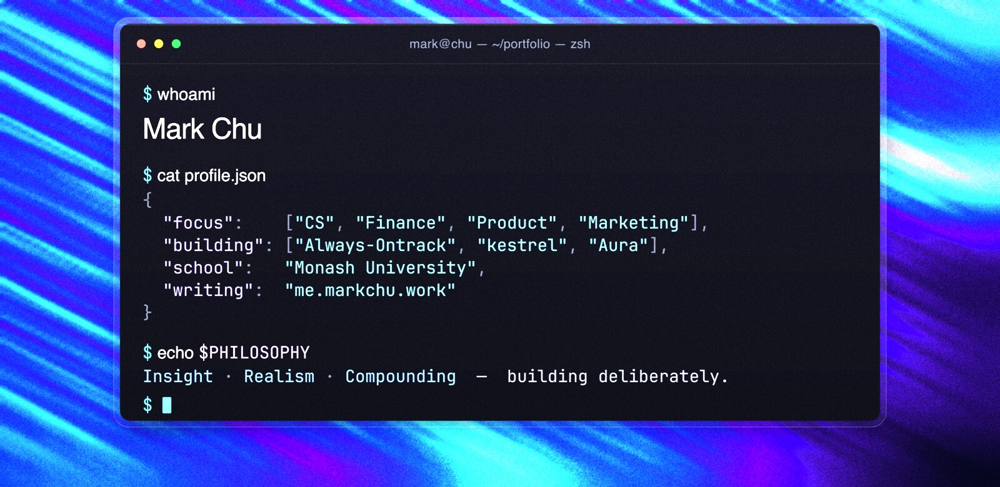

<!--
  Mark Chu — GitHub profile README
  Design system: see DESIGN.md
  Hero is a rasterized JPEG (GitHub strips animated SVG; grain kills PNG compression).
  Every embed below is curl-verified HTTP 200. No portfolio site link — the README IS the showcase.
-->

  

 

  

 

  

 

  

 

  
  &nbsp;
  
  &nbsp;
  
  &nbsp;
  

 

  

