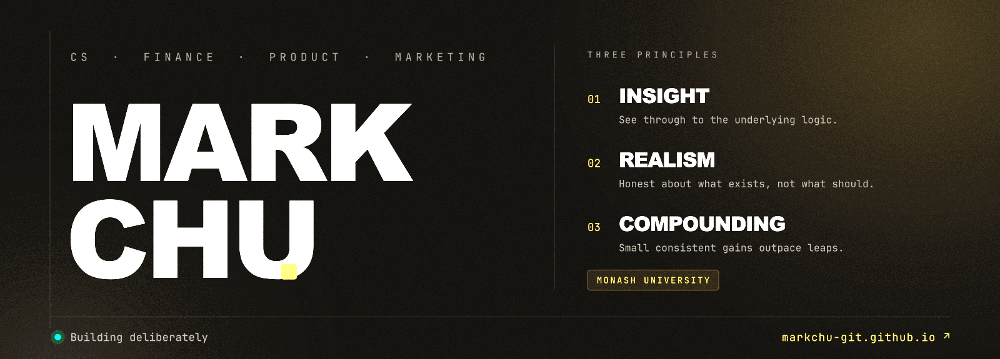

<!--
  Mark Chu — GitHub profile README
  Design system: see DESIGN.md
  Hero is a rasterized PNG (GitHub strips animated SVG). Every embed below is curl-verified HTTP 200.
-->

  

 

  

 

  

 

  

 

  
  &nbsp;
  
  &nbsp;
  
  &nbsp;
  

 

  

